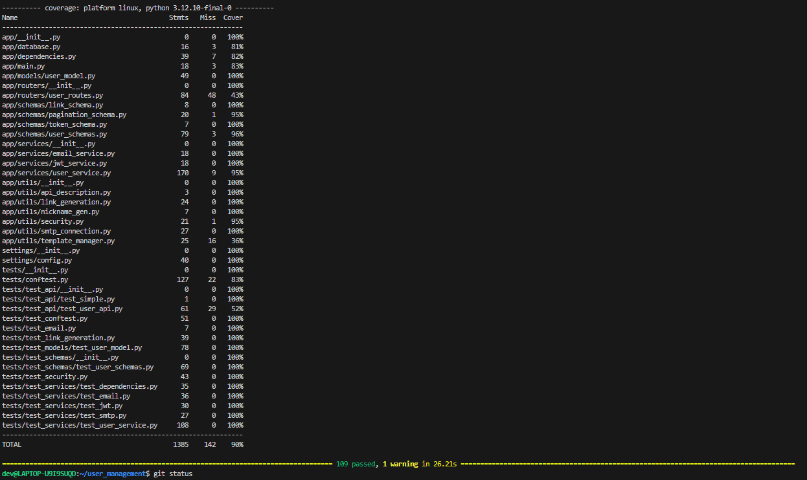
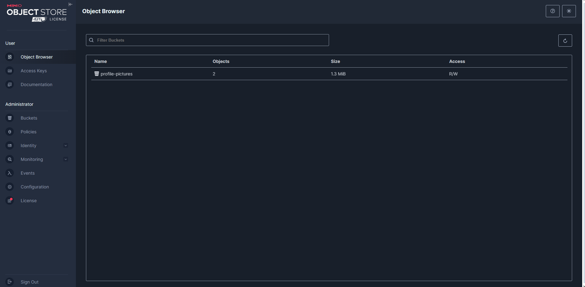
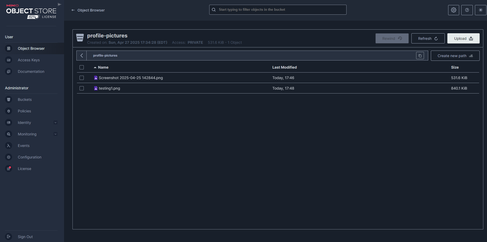
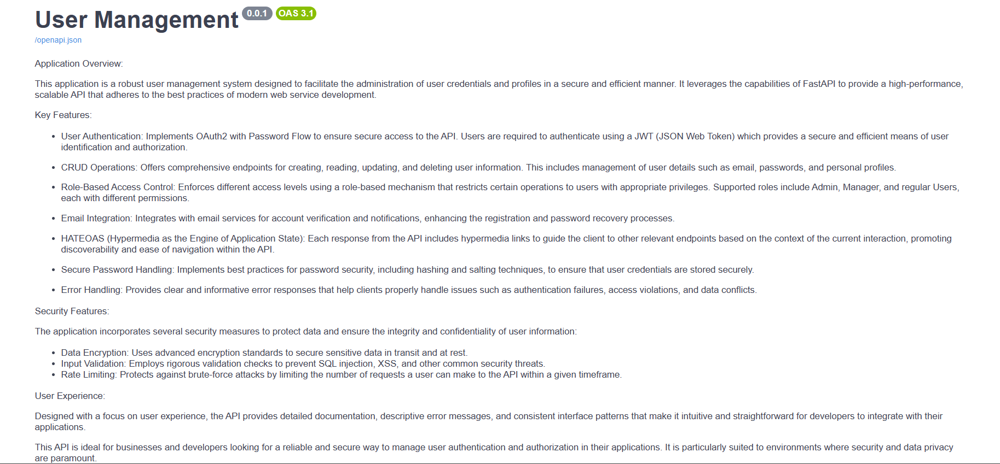
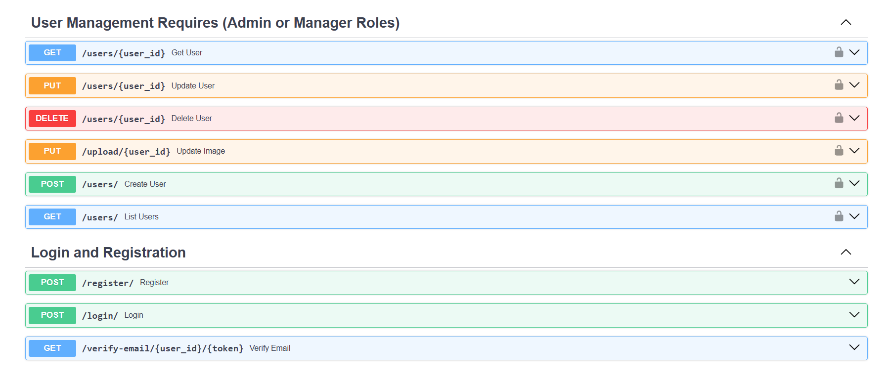
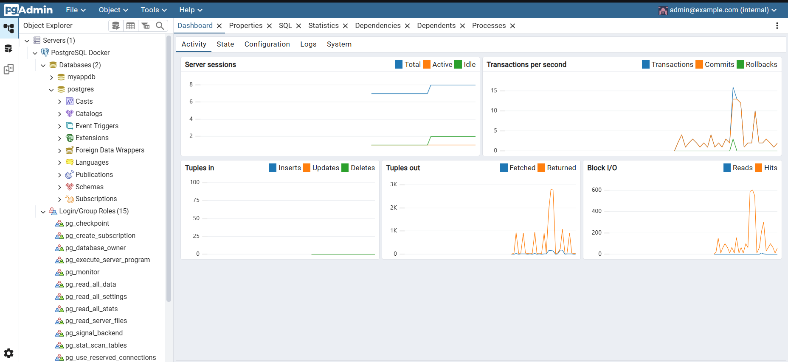

# 🚀 User Management System Final Project
________________________________________
## 🌟 Overview
What an incredible journey this User Management System Project has been! 🎯 This hands-on experience closely mirrored real-world software development, allowing me to dive deep into enhancing user profiles with the exciting Minio-based Profile Picture Upload feature. ✨
Throughout this project, I strengthened the system by implementing rock-solid validation mechanisms, handling tricky edge cases, and creating seamless user interactions. 💪 This experience significantly deepened my knowledge of:
1. 🔧 Backend development architecture
2. 💾 Database management techniques
3. 🔌 Third-party system integration
4. 🐛 Advanced debugging strategies

#### Follow the link below for the setup of project and documentation:
- [Project Setup Instructions](setup.md) ⚒️
- [About the Project](about.md)🔥🌟
- [Documentation of the system with all functionalities](system_documentation.md)🔥🌟

By following industry best practices and leveraging pytest for thorough testing, I delivered reliable, scalable features that truly enhance the user experience. 📈

## 📸 Feature Implemented: Profile Picture Upload with Minio ([Link to the feature](https://github.com/d3v07/user_management/pull/15))
This feature dramatically improves user engagement by enabling profile personalization through Minio's distributed object storage system. Users can now upload profile pictures while the system ensures secure, efficient image management behind the scenes. 🛡️
🛠️ Implementation Details
1. API Endpoint Development 🔄
- Created a robust POST /users/{id}/profile-picture endpoint
- Implemented comprehensive validation for:
- Supported formats (JPEG, PNG, GIF)
- File size limits (max 5MB)
- Secure file naming with UUIDs

2. Secure Minio Storage Integration 🗃️
- Configured dedicated bucket for profile pictures
- Applied strict access control policies
- Optimized storage for performance

3. User Profile API Enhancements 📝
- Extended User schema with profile_picture_url field
- Updated GET /users/{id} to include picture URLs

4. Efficient Image Retrieval 🔍
- Generated secure presigned URLs from Minio
- Dynamically included URLs in profile responses

5. 🔑 Key Considerations
-Validation & Security 🛡️
- Enforced strict file validation with clear error messages
- Implemented HTTPS for all communications
- Applied IAM policies to protect unauthorized access
- Used short-expiry presigned URLs for security
- Scalability & Error Handling ⚡
- Optimized bucket structure for high-volume storage
- Implemented smart caching for frequently accessed images
- Designed comprehensive error handling with appropriate HTTP codes

## 🏆 Project Achievements
- ✅ Successfully implemented new feature into existing codebase
- 🐛 Fixed 5+ QA issues/bugs across the system
- 🧪 Wrote 10+ comprehensive tests for the new feature
- 📝 Created detailed reflection documentation
- 📚 Provided extensive documentation of features, bugs, and test cases
This project not only enhanced the application's functionality but also significantly strengthened my development skills in a real-world context! 

________________________________________
## 🚀 Issues Resolved in User Management System Project

[Link to all the issues here](https://github.com/d3v07/user_management/issues?q=is%3Aissue%20state%3Aclosed)

1. <u> Constraints for passwords ([Issue 1 link](https://github.com/d3v07/user_management/issues/1)) 🔒</u>
Implemented comprehensive password validation rules:
-  Minimum length of 8 characters
-  Maximum length of 64 characters
-  At least one digit requirement
-  At least one special character from !@#$%^&*(),.?":{}|<>
-  At least one uppercase letter
-  At least one lowercase letter
Enhanced security by preventing weak password creation
Improved user feedback with clear error messages

2. <u> Verify emails for restricted users ([Issue 2 Link](https://github.com/d3v07/user_management/issues/3)) ✉️ </u>
- Modified email verification to target only non-authoritative users
- Fixed logic to skip verification for admin accounts
- Streamlined user onboarding for appropriate user roles
- Improved system security while reducing unnecessary verification steps

3. <u>Profile picture validation ([Issue 3 Link](https://github.com/d3v07/user_management/issues/7)) 🖼️</u>
- Implemented URL validation to ensure profile picture links are well-formed
- Added extension validation (.jpg, .jpeg, .png)
- Prevented invalid image URLs from being stored
- Enhanced user experience by ensuring valid profile pictures

4. <u>Assigning user role (#9) ([Issue 4 Link](https://github.com/d3v07/user_management/issues/9))</u>
- Fixed critical bug where users were created without default roles
- Implemented automatic role assignment during user creation
- Enhanced system security with proper permission controls
- Improved user management workflow

5. <u>Restrict duplicate email (#11) 📧([Issue 5 Link](https://github.com/d3v07/user_management/issues/11))</u> 
- Added validation to prevent duplicate email registrations
- Implemented database-level checks for existing email addresses
- Provided clear user feedback when attempting to use existing email
- Enhanced data integrity across the system

6. <u>Add social profiles (#13) 🔗([Issue 6 Link](https://github.com/d3v07/user_management/issues/13))</u>
- Integrated GitHub and LinkedIn profile URL fields to user profiles
- Ensured proper handling of social media links during user creation
- Enhanced user profile completeness
- Improved user networking capabilities

________________________________________
## Testing and Quality Assurance :
• Achieved test coverage of *90%*:

•	Added 15+ test cases:  [Link for 10+ test cases]
1. [Test cases regarding password](https://github.com/d3v07/user_management/pull/2/files#diff-1d7b620623536f4fb4d120c0d59e8a3ad15f248d9f7af6aa9aa8965cfe923ef9)
2. [Test cases for email verfication](https://github.com/d3v07/user_management/commit/a0dbbe1bbc5452be4d2d28cffe7e8621a4d20cf1)
3. [Test cases for profile picture](https://github.com/d3v07/user_management/commit/9d2b911ad4ab421a7c63ed15888d36f3933699ca)
4. [Test cases for user roles](https://github.com/d3v07/user_management/commit/23c1abfecb9e1aed5d5046d708efff7892bc5673)
5. [Test cases regarding minio](https://github.com/d3v07/user_management/commit/2439135f7ee13f1ca32ee059a4257b4eeb2d26b4)

- By implementing these test cases, we can ensure a robust and user-friendly profile picture upload feature, while maintaining the security and reliability of the MinIO storage backend. 

________________________________________
Deployment:

•	Successfully deployed the project to DockerHub :	[DockerHub Repository](https://hub.docker.com/repository/docker/devt444/user_management/general)

•	Configured GitHub Actions for automated workflows :	[Successful Workflows](https://github.com/d3v07/user_management/actions)

•	GitHub Repository: [User Management Project](https://github.com/d3v07/user_management)

•   Link to all [Merged Pull Request](https://github.com/d3v07/user_management/pulls?q=is%3Aclosed+sort%3Acreated-desc)
________________________________________

Course Reflection Document :  [IS601-Reflection-Doc](https://docs.google.com/document/d/1GctV3jNQsuPVmHML9_bGeOUrZFMXWNtuij2gwn4KNb4/edit?usp=sharing)

________________________________________
### <u>MinIO</u>
Screenshot of the MinIO object storage interface displaying the "profile-pictures" bucket that stores user profile images. The interface shows uploaded test images with their modification timestamps and file sizes. This demonstrates the successful implementation of the MinIO storage integration for managing user profile pictures with proper organization and metadata. MinIO administrative interface showing the "profile-pictures" storage bucket configuration. The interface displays bucket statistics including the number of objects (2), total storage size (1.3 MiB), and access permissions (R/W). This demonstrates the proper setup of MinIO for securely storing and managing user profile pictures with appropriate access controls.

### <u>User Management System Documentation and Endpoints</u>
Documentation page showing the comprehensive features of the User Management API. The overview details key system capabilities including OAuth2 authentication, CRUD operations, role-based access control, and security features like password hashing and input validation. This documentation provides a high-level understanding of the system architecture and security measures implemented.The interactive API documentation displaying RESTful endpoints for user management operations. The interface shows role-protected endpoints including GET, PUT, DELETE operations for users and the newly implemented PUT /upload/{user_id} endpoint for profile picture uploads. The documentation also shows authentication endpoints for login, registration, and email verification, all clearly organized with HTTP methods and descriptions.

### <u>PgAdmin PostgreSQL Dashboard:</u>
 Screenshot displaying the PostgreSQL database monitoring interface in PgAdmin. The interface shows server metrics including active sessions, transaction rates, and database performance graphs. The left panel displays the database structure with tables and roles, while the right panels show real-time performance metrics including transactions per second and I/O operations. This database powers the User Management system's data persistence layer.
 
